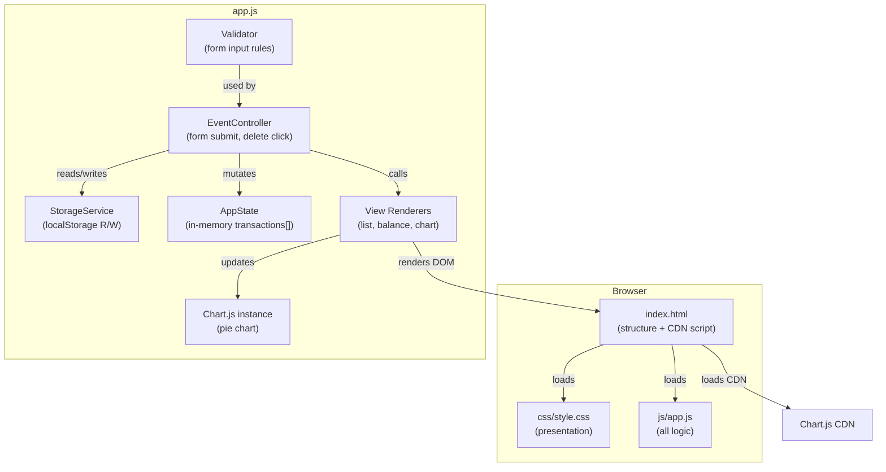

# Design Document — Expense & Budget Visualizer

## Overview

The Expense & Budget Visualizer is a **client-side-only** single-page application (SPA) built with plain HTML, CSS, and Vanilla JavaScript. There is no backend, no build step, and no package manager — the file can be opened directly in a browser as a local file or served from any static host.

Key technical constraints derived from the requirements:

- **Storage**: Browser `localStorage` only (Requirement 5)
- **Libraries**: A charting library loaded via CDN `<script>` tag; no extra JS files (Requirement 6.4)
- **File structure**: One `index.html`, one `css/style.css`, one `js/app.js` (Requirement 6.1)
- **Browser targets**: Latest stable Chrome, Firefox, Edge, Safari (Requirement 7.1)
- **Performance**: Initial render ≤ 3 s; UI interactions ≤ 200 ms (Requirement 6.3)

The chosen charting library is **Chart.js** (v4, loaded from the `cdnjs` CDN). Chart.js is the most widely used canvas-based charting library for the browser, has zero runtime dependencies, ships a standalone UMD bundle, and supports pie charts with built-in label rendering.

---

## Architecture

The application follows a **Model → Controller → View** pattern implemented inside a single `app.js` file, using plain functions and module-level state rather than a framework.



**Data flow for adding a transaction:**

1. User fills Transaction_Form and clicks Add.
2. `EventController` intercepts the `submit` event.
3. `Validator` checks inputs → returns errors or a clean `Transaction` object.
4. On success: `StorageService.save()` persists, `AppState.transactions` is updated, all three View Renderers are called.
5. On failure: error messages are injected into the DOM adjacent to invalid fields.

**Data flow on page load:**

1. `DOMContentLoaded` fires.
2. `StorageService.load()` reads localStorage; on parse error, shows an error banner and returns `[]`.
3. `AppState.transactions` is populated.
4. All View Renderers are called once to hydrate the UI.

---

## Components and Interfaces

### StorageService

Responsible for all `localStorage` interactions. Isolated so the rest of the app never touches `localStorage` directly.

```js
// StorageService
const STORAGE_KEY = 'ebv_transactions';

function load(): Transaction[] | []
// Returns parsed array from localStorage, or [] on missing / parse error.
// Displays error banner if parse fails (Req 5.4).

function save(transactions: Transaction[]): void
// Serializes and writes to localStorage synchronously.
// Throws StorageWriteError if localStorage is unavailable.
```

### AppState

Single mutable in-memory state object. All mutations go through helper functions to keep side-effects predictable.

```js
const state = {
  transactions: Transaction[]   // ordered by insertion (oldest first)
};

function addTransaction(tx: Transaction): void
function removeTransaction(id: string): void
function getTransactions(): Transaction[]
```

### Validator

Pure functions — no side effects. Returns a validation result the Controller uses to decide whether to commit or render errors.

```js
function validateForm(name: string, amount: string, category: string): ValidationResult

type ValidationResult =
  | { valid: true;  transaction: RawFormData }
  | { valid: false; errors: FieldErrors }

type FieldErrors = {
  name?:     string   // e.g. "Item name is required"
  amount?:   string   // e.g. "Amount must be between 0.01 and 999,999,999.99"
  category?: string   // e.g. "Please select a category"
}
```

### EventController

Wires DOM events to state mutations and view updates.

```js
function handleFormSubmit(event: SubmitEvent): void
// 1. Prevents default. 2. Reads form fields. 3. Calls Validator.
// On valid: addTransaction, StorageService.save, renderAll, resetForm.
// On invalid: renderFormErrors.

function handleDeleteClick(event: MouseEvent): void
// Reads transaction id from data attribute. Calls removeTransaction,
// StorageService.save, renderAll.
// On StorageWriteError: displays delete-error message, rolls back state.
```

### View Renderers

Each renderer is a pure DOM-manipulation function that takes the current state and updates one UI region.

```js
function renderTransactionList(transactions: Transaction[]): void
// Clears and rebuilds the list. Renders empty-state message when array is empty.

function renderBalanceDisplay(transactions: Transaction[]): void
// Sums amounts, formats to 2 d.p., injects into Balance_Display element.

function renderChart(transactions: Transaction[]): void
// Computes per-category totals, updates Chart.js instance.
// Renders empty-state message when array is empty.

function renderAll(): void
// Calls all three renderers with current state.transactions.
```

### Chart.js Integration

A single Chart.js `Pie` instance is created on `DOMContentLoaded` and reused on every update (calling `chart.data = …` + `chart.update()`). This avoids destroying and recreating the canvas, which prevents flickering.

```js
let chartInstance: Chart | null = null;

function initChart(canvasId: string): void
// Creates the Chart.js instance with category colors.

function updateChart(categoryTotals: CategoryTotals): void
// Updates data and labels, calls chart.update('active').
```

---

## Data Models

### Transaction

The canonical unit of data stored and manipulated throughout the app.

```js
/**
 * @typedef {Object} Transaction
 * @property {string} id        - UUID v4 generated at creation time (crypto.randomUUID)
 * @property {string} name      - Item name, 1–100 characters
 * @property {number} amount    - Positive float, 0.01–999,999,999.99
 * @property {Category} category
 * @property {number} timestamp - Date.now() at insertion; used for insertion-order sort
 */

/**
 * @typedef {'Food' | 'Transport' | 'Fun'} Category
 */
```

### Storage Schema

Transactions are persisted as a JSON array under the key `ebv_transactions`:

```json
[
  {
    "id": "550e8400-e29b-41d4-a716-446655440000",
    "name": "Lunch",
    "amount": 12.50,
    "category": "Food",
    "timestamp": 1718000000000
  }
]
```

Rationale for flat array (not object map): insertion-order sort is trivially maintained; no secondary index is needed; `JSON.stringify` / `JSON.parse` round-trips cleanly.

### CategoryTotals (derived, never persisted)

```js
/**
 * @typedef {Object} CategoryTotals
 * @property {number} Food
 * @property {number} Transport
 * @property {number} Fun
 */
```

Computed on demand from `AppState.transactions` before each chart render.

### ValidationResult

```js
/**
 * @typedef {Object} ValidationResult
 * @property {boolean} valid
 * @property {RawFormData|null} transaction  - populated when valid === true
 * @property {FieldErrors|null} errors       - populated when valid === false
 */
```

---

## Correctness Properties

*A property is a characteristic or behavior that should hold true across all valid executions of a system — essentially, a formal statement about what the system should do. Properties serve as the bridge between human-readable specifications and machine-verifiable correctness guarantees.*

### Property 1: Whitespace and empty item names are rejected

*For any* string composed entirely of whitespace characters (or the empty string), submitting it as an item name SHALL be rejected by the Validator, leaving the transaction list unchanged.

**Validates: Requirements 1.2, 1.3**

---

### Property 2: Amount boundary enforcement

*For any* numeric string that is either ≤ 0 or > 999,999,999.99 or non-numeric, the Validator SHALL reject it, and no transaction SHALL be added to the list.

**Validates: Requirements 1.2, 1.3**

---

### Property 3: Balance equals sum of transaction amounts

*For any* list of transactions, the value shown in Balance_Display SHALL equal the arithmetic sum of all `transaction.amount` values, formatted to exactly 2 decimal places.

**Validates: Requirements 3.1, 3.2, 3.3, 3.5**

---

### Property 4: Storage round-trip preserves transactions

*For any* list of transactions, serializing to localStorage and then deserializing SHALL produce a list that is structurally equivalent (same ids, names, amounts, categories, and timestamps) to the original.

**Validates: Requirements 5.1, 5.2, 5.3**

---

### Property 5: Chart slice percentages sum to 100 %

*For any* non-empty list of transactions, the percentage values calculated for all visible Chart slices SHALL sum to 100 % (within floating-point rounding tolerance of ±0.1 %).

**Validates: Requirements 4.1, 4.7**

---

### Property 6: Delete removes exactly one transaction

*For any* list of transactions and any transaction id present in that list, deleting the transaction by id SHALL produce a list with exactly one fewer element, and the remaining elements SHALL be unchanged.

**Validates: Requirements 2.4**

---

### Property 7: Empty-category slices are omitted

*For any* list of transactions where one or more categories have a total of zero, the Chart SHALL contain no slice for those categories, and the remaining slices SHALL still sum to 100 %.

**Validates: Requirements 4.6, 4.7**

---

## Error Handling

| Scenario | Behavior |
|---|---|
| Validator rejects one or more fields | Inline error message rendered adjacent to each invalid field; form is not submitted; transaction list unchanged |
| `localStorage` unavailable on load | Empty transaction list used; persistent error banner displayed; app continues operating (Req 5.4) |
| `localStorage` parse error on load | Same as unavailable (Req 5.4) |
| `localStorage` write failure on add | `StorageWriteError` caught; transaction rolled back from state; error message shown to user |
| `localStorage` write failure on delete | `StorageWriteError` caught; transaction retained in state; error message shown (Req 2.5) |
| `crypto.randomUUID` unavailable | Fallback UUID generator using `Math.random` is used (Req 7.2 — only standard Web APIs; `crypto` is standard but may be absent in very old contexts) |
| Required Web API unavailable (e.g., `localStorage`) | Error banner shown: "Your browser is not supported" (Req 7.3) |
| Chart.js CDN fails to load | Canvas area shows a static error message "Chart could not be loaded" |

All error messages are injected into dedicated `<div role="alert" aria-live="polite">` elements to ensure screen-reader accessibility.

---

## Testing Strategy

### Unit Tests

Unit tests cover pure logic layers — Validator, StorageService (with a `localStorage` mock), and the balance/category calculation helpers.

Priority test cases:

- Validator rejects empty name, whitespace-only name, zero amount, negative amount, out-of-range amount, missing category
- Validator accepts valid boundary values (amount = 0.01, amount = 999,999,999.99)
- `computeBalance` returns 0.00 for an empty array
- `computeBalance` returns correct sum for a mixed list
- `computeCategoryTotals` returns zero for absent categories
- `StorageService.load` returns `[]` and triggers error banner on `JSON.parse` failure
- `StorageService.save` then `load` round-trips a transaction list correctly

### Property-Based Tests

The app has several **pure functions** whose correctness must hold across a wide input space: the Validator, the balance calculator, the category-totals calculator, and the storage serializer. Property-based testing is appropriate here because:

- Input spaces are large (arbitrary strings, arbitrary floats, arbitrary lists of transactions)
- Universal properties hold regardless of input values
- 100 + iterations will surface edge cases that hand-picked examples miss

**Library**: [fast-check](https://github.com/dubzzz/fast-check) (JavaScript PBT library; runs in Node with `jest` or `vitest` as the test runner)

**Configuration**: Each property test runs a minimum of **100 iterations** (fast-check default).

**Tag format**: Each test file uses a comment: `// Feature: expense-budget-visualizer, Property N: <property_text>`

| Property | fast-check Arbitrary | Assertion |
|---|---|---|
| P1 — Whitespace names rejected | `fc.stringOf(fc.constantFrom(' ', '\t', '\n'))` | `validateForm(ws, '1', 'Food').valid === false` |
| P2 — Amount boundaries | `fc.float` outside [0.01, 999999999.99] | `validateForm('x', badAmt, 'Food').valid === false` |
| P3 — Balance equals sum | `fc.array(transactionArbitrary)` | `computeBalance(txs) === txs.reduce(sum)` |
| P4 — Storage round-trip | `fc.array(transactionArbitrary)` | `load(save(txs))` is structurally equal to `txs` |
| P5 — Slice percentages sum to 100 % | `fc.array(transactionArbitrary, {minLength: 1})` | `sum(slicePercentages) ≈ 100` |
| P6 — Delete removes exactly one | `fc.array(transactionArbitrary, {minLength: 1})` + `fc.nat` for index | `removeTransaction(txs, id).length === txs.length - 1` |
| P7 — Empty categories omitted | `fc.array` with only Food transactions | Chart labels contain no Transport or Fun |

### Integration / Smoke Tests

Because the UI layer depends on the DOM and Chart.js, integration coverage uses **Playwright** or manual browser testing:

- Page loads with no localStorage data → empty-state messages visible in list and chart
- Adding a transaction → list, balance, and chart all update within 1 s
- Deleting a transaction → correct recalculation of balance and chart
- Refreshing the page → previously added transactions are restored
- Browser-compatibility smoke test: open in Chrome, Firefox, Edge, Safari; verify no console errors and all UI regions render

### Accessibility

- All form fields have associated `<label>` elements
- Error messages use `role="alert"` and `aria-live="polite"`
- Chart canvas has an `aria-label` describing the chart purpose
- Color contrast ratios meet WCAG 2.1 AA for text and category labels
